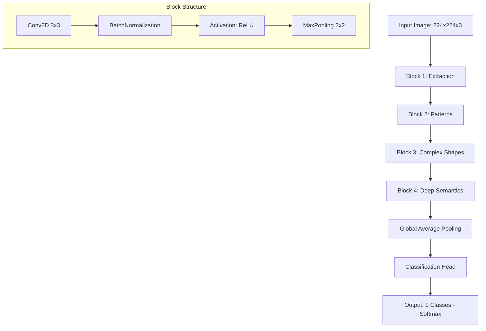

## 3. Arquitectura de la CNN Propia

El diseño de la arquitectura es el núcleo del sistema de aprendizaje. Para este proyecto, se ha diseñado una red neuronal convolucional (CNN) modular, optimizada para la extracción de características jerárquicas en entornos urbanos. El objetivo es equilibrar la profundidad necesaria para distinguir entre clases visualmente similares (como "combi" y "minibus") con una eficiencia paramétrica que permita el entrenamiento inicial en la muestra y el escalado posterior.

### 3.1. Representación del Flujo de la Arquitectura

Para garantizar una comprensión clara de la propagación de los datos, la estructura se organiza en bloques funcionales de complejidad creciente:

### 3.2. Justificación Técnica de las Decisiones de Diseño

Cada componente de la red ha sido seleccionado bajo criterios de estabilidad del gradiente y capacidad de generalización.

| Componente | Decisión Técnica | Justificación e Impacto |
| :--- | :--- | :--- |
| **Inicialización de Pesos** | He Normal (Kaiming) | Optimizado para capas con activación ReLU; evita el desvanecimiento del gradiente en las etapas iniciales del entrenamiento. |
| **Funciones de Activación** | ReLU (Rectified Linear Unit) | Proporciona no linealidad con un costo computacional mínimo y previene la saturación del gradiente en comparación con Sigmoid o Tanh. |
| **Normalización** | Batch Normalization | Aplicada después de cada convolución. Estabiliza el proceso de aprendizaje permitiendo tasas de aprendizaje más altas y actuando como un regulador ligero. |
| **Reducción Espacial** | Max Pooling (2x2) | Reduce la dimensionalidad de los mapas de características, otorgando invariancia a pequeñas traslaciones y reduciendo la carga computacional. |
| **Agregación Final** | Global Average Pooling (GAP) | En lugar de capas `Flatten` densas, GAP reduce cada mapa de características a un solo valor. Esto reduce drásticamente el número de parámetros y el riesgo de *overfitting*. |

### 3.3. Configuración Detallada de Capas

La arquitectura sigue una progresión de filtros de potencia de 2 ($32, 64, 128, 256$), lo que permite que las capas profundas capturen conceptos abstractos mientras que las iniciales se enfocan en texturas y bordes.

1.  **Bloques Convolucionales:** Se utilizan kernels de **3x3** con *padding="same"*. Este tamaño es el estándar de la industria (popularizado por VGG), ya que permite capturar relaciones espaciales locales con menos parámetros que kernels más grandes, y al apilarse, simulan campos receptivos mayores.
2.  **Regularización por Dropout:** Se integra una capa de `Dropout` con una tasa de **0.4** antes de la capa de salida. 
    *   *Impacto:* Es crucial durante el entrenamiento con la muestra de 300 imágenes para forzar a la red a no depender de neuronas específicas, mejorando la robustez.
3.  **Capa de Salida:** Una capa `Dense` con 9 unidades (correspondientes a las categorías vehiculares) y activación **Softmax**.
    *   *Función:* Transforma los valores logit finales en una distribución de probabilidad que suma 1, facilitando la interpretación del modelo como un clasificador multiclase.

### 3.4. Consideraciones de Keras 3 y Escalabilidad

Al implementar esta arquitectura en Keras 3, se utiliza la **API Funcional** o la clase **Sequential** con nombres de capa explícitos. Esto facilita el "Model Introspection" (inspección del modelo) y la depuración de dimensiones. 

Para el escalado a 50 GB, esta arquitectura es lo suficientemente ligera para ser entrenada desde cero en un tiempo razonable, pero posee la profundidad necesaria para que, en etapas posteriores, podamos congelar los bloques iniciales y realizar un ajuste fino (*fine-tuning*) si decidimos convertirla en una red pre-entrenada para otras tareas dentro del mismo proyecto.

### 3.5. Impacto en el Pipeline Completo

Esta arquitectura define el "Presupuesto de Memoria" del proyecto. Al conocer el número total de parámetros (estimado en ~1.5 millones para este diseño), podemos calcular el tamaño del lote (*batch size*) máximo que nuestra GPU podrá procesar en los puntos siguientes del pipeline, garantizando que el flujo de entrenamiento sea fluido y sin errores de *Out of Memory* (OOM).
