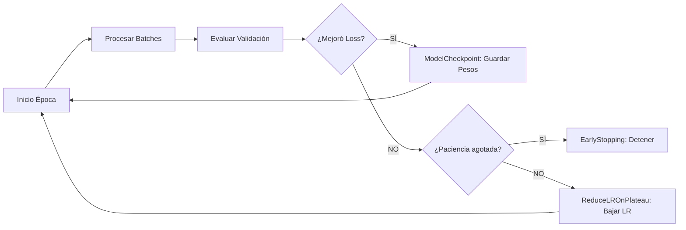

## 5. Ciclo de Entrenamiento y Regularización

El ciclo de entrenamiento representa la fase operativa donde la arquitectura (Punto 3) y la estrategia de optimización (Punto 4) convergen para extraer conocimiento de los datos procesados (Punto 2). En proyectos de visión artificial de gran escala, el entrenamiento no es un proceso lineal, sino un sistema controlado por mecanismos de retroalimentación llamados **Callbacks**, diseñados para maximizar la generalización y minimizar el desperdicio de recursos computacionales.

### 5.1. Dinámica del Entrenamiento: Épocas y Steps

Dada la naturaleza masiva del dataset (50 GB), la configuración de las iteraciones debe ser precisa para evitar ciclos de entrenamiento infinitos o subóptimos.

| Concepto | Configuración | Justificación Técnica |
| :--- | :--- | :--- |
| **Épocas (Epochs)** | 50 - 100 | Proporciona suficientes pasadas sobre los datos para que los filtros de la CNN converjan. Con la muestra de 300 imágenes, el número será menor debido al riesgo de sobreajuste. |
| **Steps per Epoch** | $N_{total} / Batch\_Size$ | Define cuántas actualizaciones de pesos ocurren antes de considerar terminada una época. En Keras 3, esto se calcula automáticamente desde el `PyDataset`. |
| **Validation Steps** | Proporcional al set de val. | Garantiza que la evaluación del modelo durante el entrenamiento sea estadísticamente representativa sin procesar el set de validación completo en cada paso. |

### 5.2. Estrategia de Callbacks para el Control del Modelo

Los Callbacks en Keras 3 son funciones que se ejecutan en puntos específicos del entrenamiento (al final de una época o lote). Para este pipeline, se han seleccionado tres mecanismos críticos:

1.  **EarlyStopping (Parada Temprana):**
    *   *Configuración:* `monitor='val_loss'`, `patience=10`.
    *   *Motivo:* Detiene el entrenamiento si el error en los datos de validación deja de disminuir. Esto es vital para evitar el **Overfitting**, especialmente cuando entrenamos con una muestra pequeña pero planeamos escalar a un volumen mayor.
2.  **ModelCheckpoint (Punto de Control):**
    *   *Configuración:* `save_best_only=True`, `filepath='best_model.keras'`.
    *   *Impacto:* Asegura que, al final del proceso, conservaremos el estado del modelo que obtuvo el mejor rendimiento en validación, y no simplemente el estado de la última época (que podría estar sobreajustada).
3.  **ReduceLROnPlateau (Reducción Dinámica del Learning Rate):**
    *   *Configuración:* `factor=0.2`, `patience=5`.
    *   *Justificación:* Cuando la pérdida se estanca, reducir la tasa de aprendizaje permite al optimizador realizar ajustes más finos en los pesos, ayudando a encontrar mínimos locales más profundos y estables.

### 5.3. Regularización y Prevención del Overfitting

Para garantizar que nuestra CNN aprenda patrones vehiculares generales y no memorice las imágenes de la muestra, implementamos técnicas de regularización integradas en el flujo de Keras 3:

*   **Dropout Dinámico:** Implementado en la arquitectura (Punto 3), actúa durante el ciclo de entrenamiento desactivando aleatoriamente neuronas. Esto obliga a la red a desarrollar representaciones redundantes y robustas.
*   **Decaimiento de Pesos (Weight Decay / L2 Regularization):** Se añade a las capas convolucionales para penalizar pesos excesivamente grandes.
    *   *Ventaja:* Mantiene la función de mapeo de la red suave (*smooth*), lo que mejora la respuesta del modelo ante imágenes con ruido o condiciones climáticas adversas (comunes en clips viales).

### 5.4. Consideraciones de Escalabilidad para 50 GB

Al movernos al dataset completo, la gestión de la memoria se vuelve crítica. Keras 3 permite optimizar el ciclo mediante:

1.  **Multiprocessing en `.fit()`:** Configurando `workers=8` y `use_multiprocessing=True`. Esto permite que el ciclo de entrenamiento no se detenga mientras se cargan los siguientes 50 GB de imágenes, manteniendo la utilización de la GPU al 100%.
2.  **Estrategia de Shuffling:** En datasets masivos, no se baraja el dataset completo (lo cual es costoso en I/O), sino que se utiliza un **Buffer de Shuffling** que baraja los datos localmente mientras se leen, manteniendo la aleatoriedad necesaria para el descenso de gradiente estocástico.

### 5.5. Impacto en el Pipeline Completo

Este ciclo de entrenamiento produce los artefactos finales (pesos y logs) que serán analizados en la fase de evaluación (Punto 6). La correcta implementación de los Callbacks garantiza que el análisis comparativo con PyTorch y Scikit-learn se realice sobre la **mejor versión posible** de nuestra arquitectura Keras, asegurando una competencia justa entre los diferentes enfoques tecnológicos.
