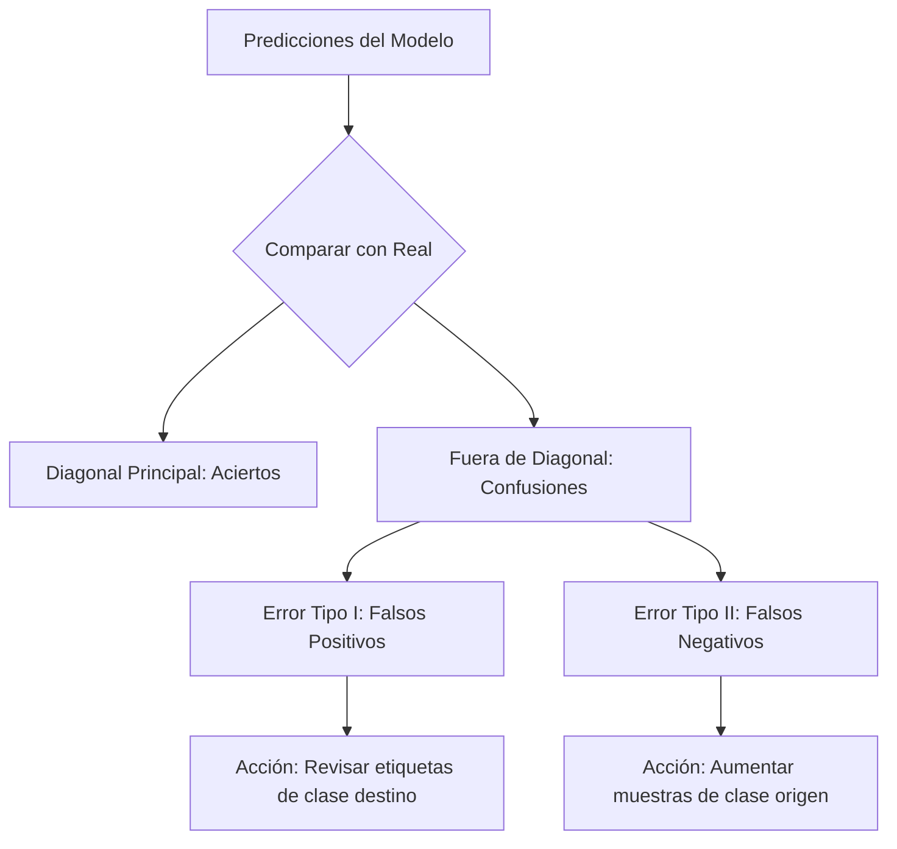

## 6. Evaluación de Rendimiento y Análisis de Errores

La evaluación técnica en Keras 3 trasciende la observación de la precisión final. En un sistema de visión artificial profesional, esta etapa busca diagnosticar la capacidad de generalización del modelo y desglosar su comportamiento ante cada una de las 9 clases vehiculares. Dado que el *SMART Challenge 2026* utiliza una métrica basada en el promedio por clase, la evaluación debe centrarse en el equilibrio del rendimiento y no solo en el acierto global.

### 6.1. Protocolo de Evaluación Multimétrica

Para un problema de clasificación de 9 clases con potencial desbalance (por ejemplo, predominancia de la clase "auto"), el uso de *Accuracy* es insuficiente. Se implementa un reporte basado en promedios "Macro", donde cada categoría tiene el mismo peso independientemente de su frecuencia.

| Métrica | Definición Técnica | Utilidad en el Proyecto |
| :--- | :--- | :--- |
| **Precision (Precisión)** | $\frac{VP}{VP + FP}$ | Mide la calidad de la predicción: de todos los "camiones" detectados, cuántos lo eran realmente. |
| **Recall (Sensibilidad)** | $\frac{VP}{VP + FN}$ | Mide la capacidad de captura: cuántas "motocicletas" del total real logró identificar el modelo. |
| **F1-Score (Macro)** | $2 \cdot \frac{Prec \cdot Rec}{Prec + Rec}$ | Media armónica que penaliza desequilibrios entre Precision y Recall. Es el indicador principal de éxito. |
| **Top-3 Accuracy** | Acierto en el top 3 de prob. | Evalúa si el modelo está "cerca" de la respuesta correcta en casos de ambigüedad visual. |

### 6.2. Diagnóstico mediante Matriz de Confusión

La matriz de confusión es la herramienta fundamental para identificar sesgos arquitectónicos o problemas en el dataset. En Keras 3, generamos esta matriz utilizando el set de validación (o test) una vez finalizado el entrenamiento.

*   **Impacto Técnico:** Si la matriz muestra una alta confusión entre "combi" y "minibus", esto indica que los filtros de la CNN (Punto 3) no están capturando características discriminatorias suficientes (como la longitud del chasis o el número de ventanas).
*   **Decisión de Ingeniería:** Ante confusiones sistemáticas, se optará por re-entrenar con mayor resolución (por ejemplo, de 224 a 299) o aplicar un *Data Augmentation* más agresivo centrado en esas clases específicas.

### 6.3. Curvas de Aprendizaje y Estabilidad

Se analizan las gráficas de *Loss* y *Accuracy* generadas durante el entrenamiento para detectar anomalías en la convergencia:

1.  **Overfitting (Sobreajuste):** La pérdida de entrenamiento baja, pero la de validación sube. 
    *   *Remedio:* Aumentar la tasa de *Dropout* o simplificar la arquitectura.
2.  **Underfitting (Subajuste):** Ambas pérdidas son altas y no convergen. 
    *   *Remedio:* Aumentar la profundidad de la red o extender el número de épocas.
3.  **Inestabilidad:** Saltos bruscos en la pérdida de validación. 
    *   *Remedio:* Reducir el *Learning Rate* (Punto 4) o revisar la normalización de los datos (Punto 2).

### 6.4. Inspección Visual de Predicciones y Mapas de Calor (Grad-CAM)

Para validar que la CNN propia está "mirando" el objeto correcto y no el fondo (por ejemplo, el asfalto o árboles), se implementa una técnica de interpretabilidad visual.

*   **Implementación:** Se seleccionan muestras donde el modelo falló con alta confianza. Se utiliza **Grad-CAM (Gradient-weighted Class Activation Mapping)** para visualizar qué regiones de la imagen activaron las neuronas de la última capa convolucional.
*   **Justificación:** Si el modelo clasifica un "mototaxi" basándose en el color del suelo en lugar de la forma del vehículo, el sistema no es robusto y fallará al escalar a los 50 GB en diferentes intersecciones.

### 6.5. Evaluación en la Escala de 50 GB

Cuando el volumen de datos crece, la evaluación deja de ser un proceso único y se convierte en un **Monitoreo por Lotes**.
*   **Evaluación Distribuida:** Keras 3 permite distribuir la evaluación en múltiples GPUs. 
*   **Inferencia en Tiempo Real:** Se mide la latencia (ms por imagen). Si el modelo es preciso pero tarda más de 100ms en procesar una imagen, se considerará demasiado lento para aplicaciones de tráfico en tiempo real, lo que obligaría a una optimización en el Punto 8.

Este proceso de evaluación proporciona el sustento científico para comparar nuestra CNN de Keras 3 con los modelos de Scikit-learn, PyTorch y YOLOv8, asegurando que las conclusiones del análisis comparativo se basen en una comprensión profunda de las debilidades y fortalezas del modelo desarrollado.
