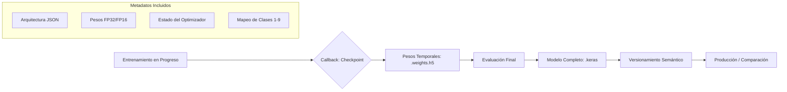

## 7. Serialización y Versionamiento del Modelo

La serialización es el proceso técnico de persistir la arquitectura, los pesos sinápticos y la configuración del entrenamiento en un formato de archivo físico. En Keras 3, este paso es crítico no solo para la reutilización del modelo, sino para garantizar la **portabilidad multi-backend**, permitiendo que un modelo entrenado en un entorno (por ejemplo, JAX) pueda ser cargado en otro (por ejemplo, PyTorch) para inferencia o comparación.

### 7.1. Estándar de Serialización: Formato Nativo `.keras`

Se ha seleccionado el formato de archivo **`.keras`** (introducido en Keras 3) sobre los formatos legados como H5 o SavedModel. Este formato es un archivo comprimido que encapsula la topología del modelo, los pesos y el estado del optimizador en un ecosistema agnóstico al framework de bajo nivel.

| Atributo | Formato `.keras` (V3) | Formato `.h5` (Legacy) | Justificación Técnica |
| :--- | :--- | :--- | :--- |
| **Portabilidad** | Alta (Multi-backend) | Limitada a Keras/TF | Permite la interoperabilidad necesaria para el análisis comparativo (Punto 8). |
| **Seguridad** | Alta (SafeTensors) | Baja (Pickle/Bytecode) | El formato V3 no utiliza ejecución de código arbitrario al cargar, evitando vulnerabilidades. |
| **Integridad** | Estricta | Flexible (propenso a errores) | Almacena exactamente la configuración de capas, eliminando discrepancias al reconstruir el modelo. |
| **Compresión** | Optimizada | Estándar | Reduce el peso del archivo, facilitando el manejo de múltiples versiones durante la escala a 50 GB. |

### 7.2. Flujo de Persistencia y Versionamiento

Para un proyecto de ingeniería, el guardado del modelo debe seguir un flujo lógico que distinga entre los estados intermedios del entrenamiento y el artefacto final de producción.

### 7.3. Estrategia de Versionamiento Semántico (Model Versioning)

Dada la naturaleza iterativa del proyecto, se implementa un esquema de versionamiento semántico para los artefactos del modelo: `M_V[Mayor].[Menor].[Parche]`.

1.  **Mayor (V1.0.0):** Cambios en la arquitectura de la CNN (por ejemplo, añadir un bloque convolucional adicional).
2.  **Menor (V1.1.0):** Cambios en los hiperparámetros (por ejemplo, ajuste del *learning rate* o cambio de optimizador).
3.  **Parche (V1.1.1):** Re-entrenamiento con datos curados o aumento de la muestra (por ejemplo, pasar de 300 imágenes a una fracción mayor de los 50 GB).

*   **Impacto:** Esto permite una trazabilidad total. Si durante la comparación con YOLOv8 se detecta una degradación, el ingeniero puede revertir exactamente a la versión de la CNN que obtuvo el mejor rendimiento.

### 7.4. Portabilidad y Consistencia del Diccionario de Clases

Un error común en la serialización de modelos de visión es perder el mapeo de los índices de salida (0-8) con las etiquetas reales (*auto*, *mototaxi*, etc.).

*   **Decisión Técnica:** Se adjunta un archivo JSON de metadatos externo o se embebe en el objeto del modelo mediante `model.save_assets()`.
*   **Motivo:** Garantiza que cualquier script de inferencia, independientemente de si usa Keras 3 o el modelo exportado a ONNX, interprete correctamente la salida de la red.

### 7.5. Consideraciones para la Escalabilidad Masiva

Al procesar los 50 GB de datos, los modelos pueden volverse significativamente más pesados si se guardan todos los estados del optimizador en cada época.

*   **Optimización de Espacio:** Se configurará el guardado para diferenciar entre el **Modelo Completo** (usado para retomar entrenamientos interrumpidos) y los **Pesos Únicamente** (`.weights.h5`), que son archivos mucho más ligeros ideales para su distribución en dispositivos con almacenamiento limitado o para el despliegue final.

### 7.6. Impacto en el Pipeline Completo

Este punto asegura que los resultados obtenidos en el Punto 6 sean permanentes y transferibles. Sin una serialización estandarizada y segura en Keras 3, sería imposible proceder al Punto 8 de comparación multimodal, ya que no habría garantía de que el modelo evaluado sea idéntico en comportamiento a través de los diferentes frameworks (Scikit-learn, PyTorch).
