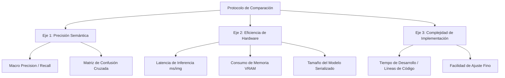

## 8. Protocolo de Comparación Multimodal

El objetivo final de este proyecto no es solo la creación de una CNN, sino la validación científica de su rendimiento frente a otros enfoques de la industria. El protocolo de comparación multimodal establece un marco de evaluación equitativo (*fair benchmarking*) para contrastar nuestra arquitectura desarrollada en Keras 3 contra tres paradigmas distintos: Machine Learning clásico (**Scikit-learn**), paridad de framework (**PyTorch**) y modelos de vanguardia (**YOLOv8**).

### 8.1. Estandarización del "Gold Standard" de Evaluación

Para que la comparación sea válida desde una perspectiva de ingeniería, todos los modelos deben ser evaluados bajo condiciones idénticas.

| Factor de Control | Especificación Técnica | Justificación |
| :--- | :--- | :--- |
| **Dataset de Test** | Muestra fija de 3 frames (0, 25, 49) | Garantiza que ningún modelo tenga ventaja por ver más datos o datos distintos. |
| **Preprocesamiento** | 224x224 píxeles / Normalización [0, 1] | Elimina sesgos derivados de la resolución o la distribución de entrada. |
| **Hardware de Inferencia** | Misma GPU (por ejemplo, NVIDIA T4 / A10G) | Asegura que las métricas de tiempo (latencia) sean comparables. |
| **Métrica Primaria** | Macro F1-Score | Penaliza a los modelos que ignoran las clases minoritarias (*combi*, *mototaxi*). |

### 8.2. Dimensiones de la Comparativa Técnica

El análisis se divide en tres ejes fundamentales: Eficacia Predictiva, Eficiencia Computacional y Viabilidad Operativa.

### 8.3. Matriz de Justificación de Competidores (Benchmarking)

| Enfoque | Tecnología | Rol en la Comparativa | Ventaja / Limitación Esperada |
| :--- | :--- | :--- | :--- |
| **Clásico** | Scikit-learn (HOG + SVM) | **Línea Base (Baseline).** Define el rendimiento mínimo aceptable sin usar Deep Learning. | *Ventaja:* Interpretable y ligero. *Limitación:* No captura características espaciales complejas; bajo rendimiento en ángulos extremos. |
| **Framework** | PyTorch (Replica CNN) | **Validación de Backend.** Evalúa si el motor de ejecución influye en la convergencia. | *Ventaja:* Control total del grafo. *Limitación:* Requiere más código "boilerplate" para igualar las utilidades de Keras 3. |
| **SOTA** | YOLOv8-OBB (Transfer Learning) | **Techo de Precisión.** Compara nuestra CNN "desde cero" contra un modelo pre-entrenado masivamente. | *Ventaja:* Máxima precisión en OBB. *Limitación:* Arquitectura de "caja negra"; difícil de optimizar para hardware muy limitado. |

### 8.4. Análisis de Escalabilidad para el Dataset de 50 GB

El protocolo de comparación debe prever cómo se comportará cada enfoque cuando el volumen de datos crezca exponencialmente:

1.  **Carga de Datos:** Mientras que Keras 3 y PyTorch escalan linealmente gracias a sus generadores de datos (Punto 2), Scikit-learn podría encontrar cuellos de botella de RAM si el modelo seleccionado (SVM) no soporta entrenamiento incremental (*Partial Fit*).
2.  **Tiempo de Convergencia:** Se documentará el tiempo necesario para alcanzar el 80% de Accuracy. Esto determinará la rentabilidad (*cost-effectiveness*) de cada tecnología para el MTC en un despliegue nacional.

### 8.5. Impacto Final del Pipeline de Implementación

La ejecución de este octavo punto cierra el ciclo de desarrollo. La CNN propia en Keras 3 se posiciona como una solución intermedia: **más potente que el ML clásico, más accesible que el código nativo de PyTorch y más personalizable que los modelos pre-entrenados como YOLO.**

Las conclusiones derivadas de este protocolo servirán como el **Dossier Técnico Digital** requerido por el concurso, justificando ante los evaluadores por qué la solución propuesta es la más equilibrada en términos de precisión por clase, velocidad de procesamiento y facilidad de mantenimiento a largo plazo para los gobiernos locales del Perú.
