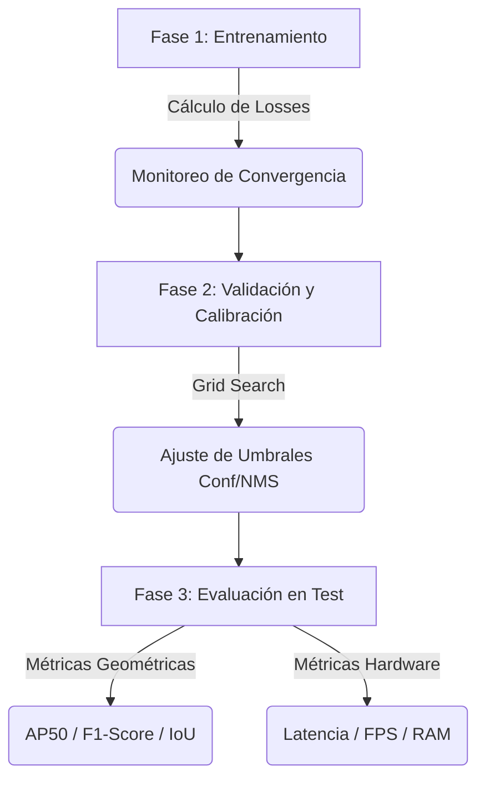
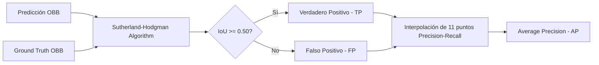
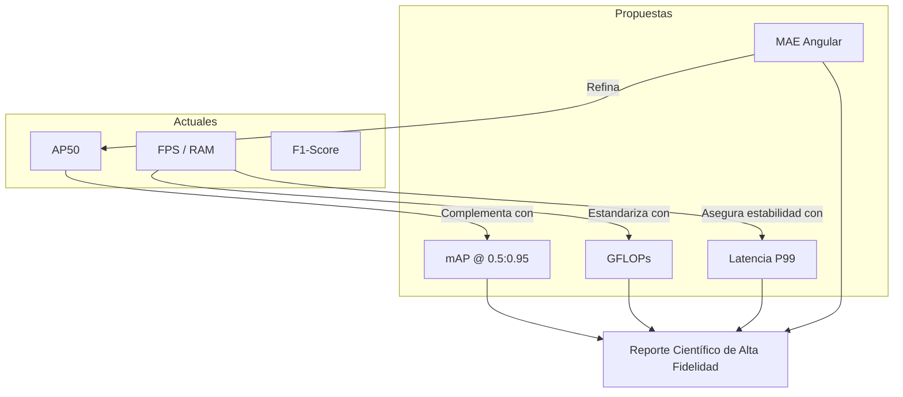

# Métricas de Evaluación

## 1. Arquitectura del Proceso de Evaluación

El pipeline de evaluación no es lineal; se divide en tres fases críticas para garantizar que las métricas finales sean representativas del rendimiento en el mundo real.

---

## 2. Métricas de Aprendizaje (Loss Functions)

Estas métricas se calculan en cada iteración del modelo. Su propósito es cuantificar el error entre la predicción cruda y la verdad de campo (*Ground Truth*).

### Resumen de Componentes de la Pérdida Total

| Métrica | Propósito | Implementación Técnica |
| :--- | :--- | :--- |
| **Objectness Loss (`obj`)** | Evalúa la capacidad de distinguir "Fondo" vs "Objeto". | `BCEWithLogitsLoss` con opción de `Focal Loss` para manejar el desbalance de clases. |
| **Classification Loss (`cls`)** | Mide la precisión en la asignación de la categoría (Car, Truck, etc.). | `CrossEntropyLoss` ponderada por la frecuencia de las clases en el dataset. |
| **Box Regression Loss (`box`)** | Cuantifica el error en la geometría de la caja (posición, tamaño y ángulo). | `SmoothL1Loss` aplicada sobre un vector de 6 parámetros $(dx, dy, \log w, \log h, \sin \theta, \cos \theta)$. |

> [!IMPORTANT]
> **Ponderación:** La pérdida de caja tiene un peso de **5.0** en el script para priorizar la precisión geométrica, que es intrínsecamente más difícil de optimizar que la clasificación.

---

## 3. Métricas de Rendimiento Geométrico (OBB)

A diferencia de la detección estándar, estas métricas consideran la **rotación del vehículo**. Se basan en el cálculo del **Oriented IoU (O-IoU)**.

### Proceso de Cálculo del mAP50 Orientado

### Detalle de Métricas de Precisión

| Métrica | Definición Conceptual | Utilidad en el Proyecto |
| :--- | :--- | :--- |
| **Macro AP50 OBB** | Promedio de la Precisión Media de todas las clases al 50% de IoU. | Es el indicador principal de la "inteligencia" general del modelo. |
| **F1-Score OBB** | Media armónica entre Precision y Recall. | Crucial para determinar el equilibrio operativo del sistema (evitar falsas alarmas sin perder vehículos). |
| **Mean Matched IoU** | Promedio de IoU exclusivamente de las detecciones exitosas (TP). | Mide la **calidad del ajuste**. Un valor alto indica que las cajas están perfectamente alineadas con los vehículos. |
| **Precision / Recall** | Proporción de aciertos sobre detecciones totales / Proporción de objetos encontrados. | Identifica si el modelo es "conservador" (alta precisión) o "agresivo" (alto recall). |

---

## 4. Métricas de Eficiencia y Despliegue (Edge Computing)

Estas métricas validan si el modelo es apto para dispositivos con recursos limitados como CPUs de bajo consumo.

### Especificaciones de Carga Computacional

| Métrica | Método de Obtención | Interpretación |
| :--- | :--- | :--- |
| **Latencia (ms/img)** | Tiempo promedio de inferencia + post-procesamiento (NMS) en CPU. | Define el retraso del sistema. Para tráfico en vivo, valores < 100ms son deseables. |
| **FPS (Frames Per Second)** | Inverso de la latencia ($1 / \text{Latencia}$). | Determina si el sistema es "tiempo real". |
| **Model Size (MB)** | Tamaño del archivo de pesos en disco. | Indica cuánta memoria Flash/SD requiere el dispositivo para almacenar el modelo. |
| **Peak RAM (MB)** | Uso máximo de memoria mediante `resource.RUSAGE_SELF`. | Crítico para dispositivos con RAM compartida (ej. Raspberry Pi con 1GB/2GB). |

---

## 5. Matriz de Interpretación de Resultados

| Si observas... | Significa que... | Acción Recomendada |
| :--- | :--- | :--- |
| **Alto AP50 pero Bajo Mean IoU** | El modelo encuentra los objetos pero las cajas "bailan" o están mal orientadas. | Aumentar el peso de `box_loss` o revisar la calidad de las etiquetas de ángulo. |
| **Alta Pérdida de Entrenamiento / Baja de Validación** | El modelo no tiene suficiente capacidad para aprender o los datos son muy ruidosos. | Revisar arquitectura o aumentar el tamaño del dataset. |
| **Alta Latencia pero pocos parámetros** | El cuello de botella no es el modelo, sino el post-procesamiento (NMS OBB). | Optimizar la función `polygon_clip` o reducir el número de propuestas de cajas. |

---

## 6. Conclusiones del Marco de Evaluación

La selección de estas métricas responde a tres pilares de investigación:

1.  **Fidelidad Geométrica:** El uso de **Sutherland-Hodgman** para el cálculo de IoU garantiza que la rotación no sea una aproximación, sino una medida matemática exacta. Esto diferencia este experimento de implementaciones simplistas.
2.  **Calibración Post-Proceso:** El pipeline incluye una etapa de calibración (`calibrate_postprocess`) que busca el mejor umbral de confianza en el set de Validación antes de tocar el set de Test. Esto previene el sobreajuste de métricas y garantiza resultados honestos.
3.  **Viabilidad en el Borde:** No se limita a la precisión. Al reportar **Peak RAM** y **Latencia en CPU**, el pipeline justifica técnicamente si el modelo puede pasar de la simulación a una cámara inteligente real.

> [!WARNING]
> **Limitación conocida:** El uso de una interpolación de 11 puntos (estilo Pascal VOC) es menos preciso que la métrica de 101 puntos o el área bajo la curva completa usada en COCO. Sin embargo, proporciona una base de comparación robusta para datasets de tamaño pequeño a mediano.

# Propuesta de Ampliación de Métricas: Estándares de Investigación Avanzada

## 1. Análisis de Brechas (Gap Analysis)

El pipeline actual mide si el modelo funciona, pero carece de métricas que expliquen por qué falla o qué tan preciso es teóricamente.

| Dimensión | Estado Actual | Brecha Identificada |
| :--- | :--- | :--- |
| **Precisión de Localización** | Solo IoU @ 0.50 | Insuficiente para evaluar la precisión fina de la orientación. |
| **Eficiencia Teórica** | Latencia (Hardware-dependiente) | Falta de una medida universal de complejidad algorítmica. |
| **Análisis de Errores** | F1-Score Agregado | No se distinguen errores de clasificación vs. errores de localización. |
| **Geometría OBB** | IoU de Polígonos | No hay una medida directa de la desviación angular ($\theta$). |

---

## 2. Métricas Recomendadas para Incorporación

### A. mAP @ [0.5 : 0.95] (Estándar COCO)
Es el promedio del mAP calculado en 10 umbrales de IoU diferentes (desde 0.5 hasta 0.95 con pasos de 0.05).

*   **Información Adicional:** Castiga severamente a los modelos que detectan el objeto pero no ajustan perfectamente la caja.
*   **Escenario de Uso:** Cuando se necesita comparar la calidad de la regresión de la caja entre diferentes arquitecturas livianas.
*   **Ventajas:** Es la métrica de referencia en la literatura moderna.

### B. GFLOPs (Giga Floating Point Operations)
Mide el número de operaciones de punto flotante necesarias para una sola inferencia.

*   **Información Adicional:** A diferencia de los FPS, los GFLOPs son constantes independientemente de si el modelo corre en una Raspberry Pi o en una GPU A100.
*   **Escenario de Uso:** Justificación de la "ligereza" del modelo en la sección de metodología del paper.
*   **Implementación:** Mediante librerías como `fvcore` o `thop` aplicadas al grafo de PyTorch.

### C. Error Angular Medio (Mean Angular Error - MAE)
Calcula el promedio de la diferencia absoluta entre el ángulo predicho y el real: $\frac{1}{n} \sum |\theta_{gt} - \theta_{pred}|$.

*   **Información Adicional:** El IoU puede ser alto incluso si el ángulo está ligeramente desviado. El MAE mide específicamente la calidad del estimador de rotación.
*   **Escenario de Uso:** Análisis de vehículos en curvas o intersecciones complejas.

### D. Latencia Percentil 99 (P99)
En lugar del promedio, mide el tiempo que tarda el 1% de las imágenes más lentas.

*   **Información Adicional:** En sistemas de borde (Edge), la consistencia es vital. Un promedio de 30 FPS no sirve si una de cada diez imágenes tarda 500ms y causa un "lag" en el sistema.

---

## 3. Flujo de Evaluación Integral Propuesto

El siguiente diagrama muestra cómo se integrarían las nuevas métricas para ofrecer una visión 360° del modelo.

---

## 4. Matriz de Impacto

| Métrica Propuesta | Impacto en la Confiabilidad | Justificación Técnica (Estado del Arte) |
| :--- | :--- | :--- |
| **mAP[.5:.95]** | **Muy Alto** | Evita el "sesgo de optimismo" del umbral 0.5. Demuestra que el modelo es útil para fotogrametría y no solo para conteo. |
| **GFLOPs** | **Alto** | Permite a otros investigadores replicar el análisis de eficiencia sin tener el mismo hardware exacto. |
| **MAE Angular** | **Medio** | Crucial para la interpretabilidad de la regresión en el espacio $(\sin \theta, \cos \theta)$ implementado en el script. |
| **P99 Latency** | **Medio** | Valida la viabilidad del modelo para sistemas de seguridad crítica en tráfico real. |

---

## 5. Priorización

### Prioridad 1: ALTA (Implementación Inmediata)
1.  **mAP @ [0.5 : 0.95]:** Requiere modificar el bucle de `evaluate` para iterar sobre múltiples umbrales de IoU.
2.  **GFLOPs:** Es una métrica de una sola ejecución. Aporta una base científica sólida a la arquitectura basada en `DepthwiseBlock`.

### Prioridad 2: MEDIA (Análisis de Diagnóstico)
1.  **Matriz de Confusión / Error Analysis:** Ayudará a entender si el modelo confunde "Van" con "Car" debido al tamaño, lo cual es común en datasets urbanos.
2.  **MAE Angular:** Importante para validar la rama de regresión de ángulo del modelo `TinyOrientedDetector`.

### Prioridad 3: BAJA (Optimización de Despliegue)
1.  **Latencia P99:** Útil únicamente si se planea hacer una demostración en video en tiempo real sobre hardware embebido.

> [!TIP]
> **Conclusión:** El pipeline actual es una base funcional. Sin embargo, la transición hacia **mAP@[0.5:0.95]** y el reporte de **GFLOPs** transformará de una prueba de concepto a un **experimento de visión por computadora de grado profesional**.
